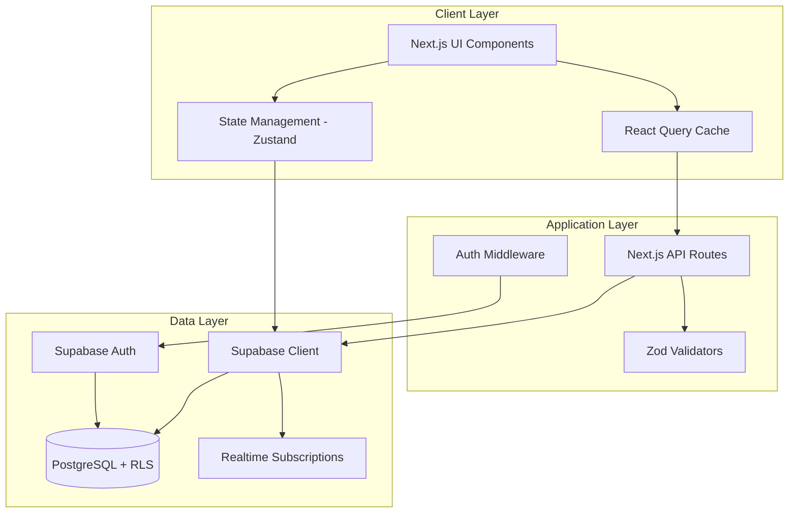
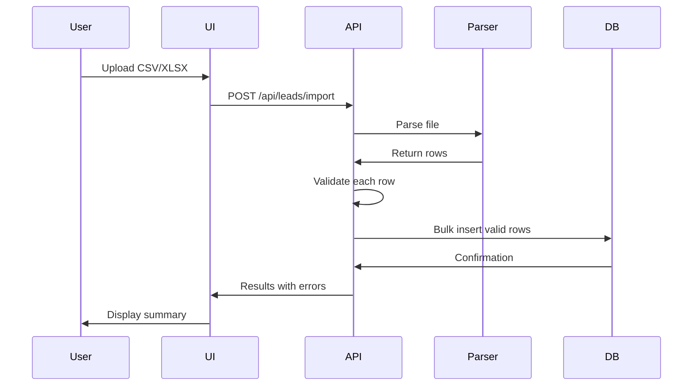

# Design Document

## Overview

The Lasy AI CRM System is architected as a modern, full-stack application using Next.js 14's App Router, TypeScript for type safety, and Supabase for backend services. The system follows a layered architecture pattern with clear separation between presentation, business logic, and data access layers. Real-time capabilities are achieved through Supabase's real-time subscriptions, while the UI leverages shadcn/ui components with a dark theme for a polished user experience.

## Architecture

### High-Level Architecture



### Technology Stack Rationale

- **Next.js 14 App Router**: Server-side rendering, API routes, and optimized routing
- **TypeScript**: Type safety and improved developer experience
- **Supabase**: Managed PostgreSQL with built-in auth, RLS, and real-time capabilities
- **React Query**: Server state management with caching and automatic refetching
- **Zustand**: Lightweight client state management for UI state
- **shadcn/ui**: Accessible, customizable components with dark theme support
- **@dnd-kit**: Modern drag-and-drop with touch support
- **Zod**: Runtime type validation for forms and API inputs

## Components and Interfaces

### 1. Authentication System

#### Components
- `LoginForm`: Email/password authentication form
- `AuthProvider`: Context provider for auth state
- `ProtectedRoute`: HOC for route protection

#### Interfaces
```typescript
interface User {
  id: string;
  email: string;
  created_at: string;
}

interface AuthState {
  user: User | null;
  session: Session | null;
  loading: boolean;
  signIn: (email: string, password: string) => Promise<void>;
  signOut: () => Promise<void>;
}
```

#### Flow
1. User submits credentials via LoginForm
2. Supabase Auth validates and creates session
3. Session token stored in httpOnly cookie
4. Middleware validates token on protected routes
5. AuthProvider exposes user state to components

### 2. Kanban Board System

#### Components
- `KanbanBoard`: Main board container with columns
- `KanbanColumn`: Individual stage column
- `LeadCard`: Draggable lead card component
- `StageAnalytics`: Lead count per stage

#### Interfaces
```typescript
interface Lead {
  id: string;
  name: string;
  email: string | null;
  phone: string | null;
  company: string | null;
  status: LeadStatus;
  notes: string | null;
  created_at: string;
  updated_at: string;
  user_id: string;
}

type LeadStatus = 'new' | 'contacted' | 'qualified' | 'pending' | 'lost'| 'won';

interface KanbanColumn {
  id: LeadStatus;
  title: string;
  leads: Lead[];
  count: number;
}
```

#### Drag-and-Drop Implementation
- Use @dnd-kit/core for drag operations
- Implement DndContext at board level
- Use useSortable hook for lead cards
- Optimistic updates for immediate feedback
- API call on drop with rollback on failure

#### Real-time Updates
```typescript
// Supabase real-time subscription
const subscription = supabase
  .channel('leads-changes')
  .on('postgres_changes', 
    { event: '*', schema: 'public', table: 'leads' },
    (payload) => {
      // Update React Query cache
      queryClient.invalidateQueries(['leads']);
    }
  )
  .subscribe();
```

### 3. Lead Management System

#### Components
- `LeadForm`: Create/edit lead form with validation
- `LeadList`: Tabular view of leads
- `LeadDetail`: Detailed lead view with timeline
- `LeadActions`: Dropdown menu for lead operations

#### Form Validation Schema
```typescript
const leadSchema = z.object({
  name: z.string().min(1, 'Name is required').max(100),
  email: z.string().email('Invalid email').optional().or(z.literal('')),
  phone: z.string().regex(/^[\d\s\-\+\(\)]+$/, 'Invalid phone').optional().or(z.literal('')),
  company: z.string().max(100).optional().or(z.literal('')),
  status: z.enum(['new', 'contacted', 'qualified', 'pending', 'lost']),
  notes: z.string().max(1000).optional().or(z.literal(''))
});
```

#### API Endpoints
- `POST /api/leads` - Create lead
- `GET /api/leads` - List leads with filters
- `GET /api/leads/[id]` - Get lead details
- `PATCH /api/leads/[id]` - Update lead
- `DELETE /api/leads/[id]` - Delete lead

### 4. Search and Filter System

#### Components
- `SearchBar`: Global search input with debouncing
- `FilterPanel`: Multi-criteria filter interface
- `SavedSearches`: Saved filter combinations

#### Search Implementation
```typescript
interface SearchParams {
  query?: string;
  status?: LeadStatus[];
  dateFrom?: string;
  dateTo?: string;
  company?: string;
}

// API endpoint with full-text search
GET /api/leads?query=john&status=new,contacted&dateFrom=2025-01-01
```

#### Search Strategy
- Client-side debouncing (300ms)
- Server-side PostgreSQL full-text search
- Index on searchable columns
- React Query for caching results
- Highlight matching text in results

### 5. Import/Export Module

#### Components
- `ImportDialog`: File upload and validation UI
- `ExportButton`: Export trigger with format selection
- `ImportProgress`: Progress indicator for bulk operations

#### File Processing Flow


#### Supported Formats
- **CSV**: Standard comma-separated values
- **XLSX**: Excel format using xlsx library

#### Validation Rules
- Required: name field
- Optional: email, phone, company, notes
- Default status: 'new'
- Email format validation
- Phone format validation
- Maximum 1000 rows per import

### 6. Interaction Timeline

#### Components
- `Timeline`: Chronological interaction list
- `InteractionForm`: Add new interaction
- `InteractionCard`: Individual interaction display

#### Interfaces
```typescript
interface Interaction {
  id: string;
  lead_id: string;
  type: InteractionType;
  description: string;
  created_at: string;
  user_id: string;
}

type InteractionType = 'call' | 'email' | 'meeting' | 'note' | 'other';
```

#### API Endpoints
- `POST /api/interactions` - Create interaction
- `GET /api/interactions?lead_id=[id]` - Get lead interactions

## Data Models

### Database Schema

```sql
-- Enable UUID extension
CREATE EXTENSION IF NOT EXISTS "uuid-ossp";

-- Users table (managed by Supabase Auth)
-- No need to create, but reference for relationships

-- Leads table
CREATE TABLE leads (
  id UUID PRIMARY KEY DEFAULT uuid_generate_v4(),
  name TEXT NOT NULL,
  email TEXT,
  phone TEXT,
  company TEXT,
  status TEXT DEFAULT 'new' CHECK (status IN ('new', 'contacted', 'qualified', 'pending', 'lost')),
  notes TEXT,
  created_at TIMESTAMPTZ DEFAULT NOW(),
  updated_at TIMESTAMPTZ DEFAULT NOW(),
  user_id UUID REFERENCES auth.users(id) ON DELETE CASCADE NOT NULL
);

-- Interactions table
CREATE TABLE interactions (
  id UUID PRIMARY KEY DEFAULT uuid_generate_v4(),
  lead_id UUID REFERENCES leads(id) ON DELETE CASCADE NOT NULL,
  type TEXT NOT NULL CHECK (type IN ('call', 'email', 'meeting', 'note', 'other')),
  description TEXT NOT NULL,
  created_at TIMESTAMPTZ DEFAULT NOW(),
  user_id UUID REFERENCES auth.users(id) ON DELETE CASCADE NOT NULL
);

-- Indexes for performance
CREATE INDEX idx_leads_user_id ON leads(user_id);
CREATE INDEX idx_leads_status ON leads(status);
CREATE INDEX idx_leads_created_at ON leads(created_at);
CREATE INDEX idx_interactions_lead_id ON interactions(lead_id);
CREATE INDEX idx_interactions_created_at ON interactions(created_at);

-- Full-text search index
CREATE INDEX idx_leads_search ON leads USING gin(
  to_tsvector('english', coalesce(name, '') || ' ' || 
                         coalesce(email, '') || ' ' || 
                         coalesce(company, '') || ' ' || 
                         coalesce(notes, ''))
);

-- Updated_at trigger
CREATE OR REPLACE FUNCTION update_updated_at_column()
RETURNS TRIGGER AS $$
BEGIN
  NEW.updated_at = NOW();
  RETURN NEW;
END;
$$ LANGUAGE plpgsql;

CREATE TRIGGER update_leads_updated_at
  BEFORE UPDATE ON leads
  FOR EACH ROW
  EXECUTE FUNCTION update_updated_at_column();
```

### Row Level Security Policies

```sql
-- Enable RLS
ALTER TABLE leads ENABLE ROW LEVEL SECURITY;
ALTER TABLE interactions ENABLE ROW LEVEL SECURITY;

-- Leads policies
CREATE POLICY "Users can view their own leads"
  ON leads FOR SELECT
  USING (auth.uid() = user_id);

CREATE POLICY "Users can insert their own leads"
  ON leads FOR INSERT
  WITH CHECK (auth.uid() = user_id);

CREATE POLICY "Users can update their own leads"
  ON leads FOR UPDATE
  USING (auth.uid() = user_id)
  WITH CHECK (auth.uid() = user_id);

CREATE POLICY "Users can delete their own leads"
  ON leads FOR DELETE
  USING (auth.uid() = user_id);

-- Interactions policies
CREATE POLICY "Users can view interactions for their leads"
  ON interactions FOR SELECT
  USING (
    EXISTS (
      SELECT 1 FROM leads
      WHERE leads.id = interactions.lead_id
      AND leads.user_id = auth.uid()
    )
  );

CREATE POLICY "Users can insert interactions for their leads"
  ON interactions FOR INSERT
  WITH CHECK (
    auth.uid() = user_id AND
    EXISTS (
      SELECT 1 FROM leads
      WHERE leads.id = interactions.lead_id
      AND leads.user_id = auth.uid()
    )
  );
```

## Error Handling

### Error Hierarchy

```typescript
class AppError extends Error {
  constructor(
    public message: string,
    public code: string,
    public statusCode: number
  ) {
    super(message);
  }
}

class ValidationError extends AppError {
  constructor(message: string, public errors: Record<string, string[]>) {
    super(message, 'VALIDATION_ERROR', 400);
  }
}

class AuthenticationError extends AppError {
  constructor(message: string = 'Authentication required') {
    super(message, 'AUTH_ERROR', 401);
  }
}

class NotFoundError extends AppError {
  constructor(resource: string) {
    super(`${resource} not found`, 'NOT_FOUND', 404);
  }
}

class DatabaseError extends AppError {
  constructor(message: string) {
    super('Database operation failed', 'DB_ERROR', 500);
  }
}
```

### Error Handling Strategy

1. **API Layer**: Catch all errors, log details, return user-friendly messages
2. **Client Layer**: Display toast notifications for errors
3. **Form Validation**: Inline error messages with field highlighting
4. **Network Errors**: Retry logic with exponential backoff
5. **Unexpected Errors**: Generic message + error boundary fallback UI

### Error Response Format

```typescript
interface ErrorResponse {
  error: {
    code: string;
    message: string;
    details?: Record<string, any>;
  };
}
```

## Testing Strategy

### Unit Testing
- **Framework**: Jest + React Testing Library
- **Coverage Target**: > 80% for business logic
- **Focus Areas**:
  - Validation schemas
  - Utility functions
  - Custom hooks
  - State management

### Integration Testing
- **Framework**: Jest + MSW (Mock Service Worker)
- **Focus Areas**:
  - API endpoints
  - Database operations
  - Authentication flows
  - Real-time subscriptions

### E2E Testing
- **Framework**: Playwright
- **Critical Paths**:
  - User login/logout
  - Lead creation and editing
  - Kanban drag-and-drop
  - Search and filter
  - Import/export operations

### Performance Testing
- **Tools**: Lighthouse CI, Web Vitals
- **Metrics**:
  - FCP < 1s
  - LCP < 2s
  - TTI < 3s
  - CLS < 0.1
  - Lighthouse score > 90

## Security Considerations

### Authentication Security
- HttpOnly cookies for session tokens
- CSRF protection via SameSite cookies
- Token expiration and refresh
- Secure password requirements (handled by Supabase)

### Data Security
- Row Level Security enforced at database level
- Input sanitization for XSS prevention
- Parameterized queries for SQL injection prevention
- HTTPS enforcement in production

### API Security
- Rate limiting on API endpoints
- Request validation with Zod
- Authentication middleware on protected routes
- CORS configuration

### Security Headers
```typescript
// middleware.ts
const securityHeaders = {
  'X-Frame-Options': 'DENY',
  'X-Content-Type-Options': 'nosniff',
  'Referrer-Policy': 'origin-when-cross-origin',
  'X-XSS-Protection': '1; mode=block',
  'Strict-Transport-Security': 'max-age=31536000; includeSubDomains'
};
```

## Performance Optimization

### Code Splitting
- Dynamic imports for heavy components
- Route-based code splitting (automatic with App Router)
- Lazy loading for modals and dialogs

### Caching Strategy
- React Query for server state (5-minute stale time)
- SWR for real-time data
- Browser caching for static assets
- CDN for public assets

### Database Optimization
- Indexes on frequently queried columns
- Connection pooling via Supabase
- Pagination for large datasets (50 items per page)
- Optimized queries with proper joins

### Bundle Optimization
- Tree shaking for unused code
- Minification and compression
- Image optimization with Next.js Image component
- Font optimization with next/font

## Responsive Design

### Breakpoint Strategy
```typescript
const breakpoints = {
  mobile: '320px',   // Mobile devices
  tablet: '481px',   // Tablets
  desktop: '769px'   // Desktop and larger
};
```

### Mobile Adaptations
- Single-column layout for Kanban on mobile
- Bottom sheet for forms on mobile
- Touch-optimized drag-and-drop
- Hamburger menu for navigation
- Larger tap targets (min 44x44px)

### Dark Theme Implementation
- CSS variables for theme colors
- shadcn/ui dark theme preset
- System preference detection
- Consistent contrast ratios (WCAG AA)

## Deployment Architecture

### Environment Configuration
- **Development**: Local Next.js dev server + Supabase
- **Staging**: Vercel preview deployment
- **Production**: Vercel production deployment

### Environment Variables
```env
NEXT_PUBLIC_SUPABASE_URL=<supabase-url>
NEXT_PUBLIC_SUPABASE_ANON_KEY=<anon-key>
NEXT_PUBLIC_APP_URL=<app-url>
```

### CI/CD Pipeline
1. Push to GitHub
2. Run tests and linting
3. Build Next.js application
4. Deploy to Vercel
5. Run smoke tests
6. Monitor performance metrics

## Monitoring and Observability

### Logging
- Client errors logged to console (dev) / service (prod)
- API errors logged with request context
- Structured logging with timestamps and user IDs

### Performance Monitoring
- Web Vitals tracking
- Lighthouse CI on every deployment
- Real User Monitoring (RUM) metrics

### Error Tracking
- Error boundaries for React errors
- API error logging
- User-friendly error messages
- Error rate alerts
